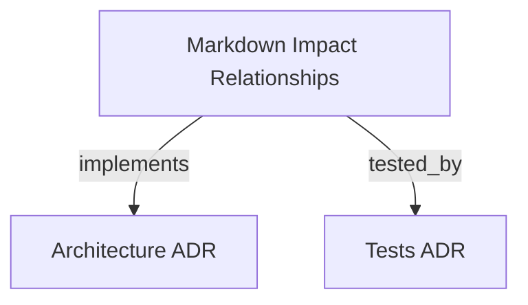

# Markdown Impact Relationships & Four-Horizon Governance
Provides Graph v2 scoped snapshotting, conservative Markdown evidence extraction, and non-authoritative four-horizon boundary governance.

```graph
{
  "node_id": "feature:markdown-impact-relationships",
  "domain": "markdown_impact_relationships",
  "implements": ["adr:architecture"],
  "tested_by": ["adr:tests"],
  "code_files": [
    "packages/graph-core/src/relationship-types.ts",
    "packages/graph-core/src/inventory.ts",
    "packages/graph-core/src/extract-markdown.ts",
    "packages/graph-core/src/relationship-policy.ts",
    "packages/graph-core/src/build.ts",
    "packages/graph-core/src/graph-checksum.ts",
    "packages/graph-core/src/impact.ts",
    "packages/graph-core/src/eap/horizon.ts",
    "packages/graph-core/src/eap/types.ts",
    "packages/graph-core/src/eap/contestation.ts",
    "packages/mcp-server/src/db.ts",
    "packages/mcp-server/src/store.ts",
    "packages/mcp-server/src/tools/graph-impact.ts",
    "packages/mcp-server/src/eap/promotion-service.ts",
    "packages/mcp-server/src/eap/contestation-service.ts",
    "packages/mcp-server/src/eap/recall-projection.ts"
  ],
  "test_files": [
    "tests/unit/test_markdown_impact_corpus.py",
    "packages/graph-core/test/build-v2.test.ts",
    "packages/graph-core/test/extract-markdown.test.ts",
    "packages/graph-core/test/impact.test.ts",
    "packages/mcp-server/test/graph-impact-markdown-integration.test.ts",
    "packages/mcp-server/test/eap-four-horizon-conformance.test.ts"
  ]
}
```

## OVERVIEW
Implements Graph v2 snapshotting isolated by `(tenantId, horizonId, graphId)` with four internal relationship types (`depends-on`, `references`, `delegates-to`, `behavioral-hypothesis`). Enforces parent promotion topology across negotiation, microtask, transformation, and persistent horizons with contestation and stale-base recall support.

## FOLDER STRUCTURE
<folder_structure>
```
packages/
├── graph-core/
│   ├── src/                 # Types, markdown extraction, inventory, checksum, impact engine
│   │   └── eap/             # Four-horizon topology, boundary envelopes, contestation contracts
│   └── test/                # Unit test suites for v2 core modules
└── mcp-server/
    ├── src/                 # SQLite/JSONL persistence, MCP tools (graph.impact v2)
    │   └── eap/             # Promotion service, contestation service, recall projections
    └── test/                # Multi-horizon and end-to-end integration test suites
```
</folder_structure>

## MAIN CONCEPTS

### Internal Graph vs Boundary Horizons
- **Internal Relationships**: `depends-on`, `references`, `delegates-to`, `behavioral-hypothesis`. Fenced code blocks in markdown do not create code import edges.
- **Horizon Boundary Topology**: `negotiation` & `microtask` -> `transformation` -> `persistent`. Cross-horizon promotions must target immediate parent or fail with `HORIZON_SKIP`.
- **Contestation & Recall**: `CONTEST` routes evidence without creating documentary edges. `RECALL` propagates `STALE_BASE` state to derived lineage.

## BEST PRACTICES
REQUIRED: Scoped Snapshotting — Every graph entity must carry tenantId, horizonId, and graphId.
REQUIRED: Revalidation on Promotion — Target horizons revalidate candidate proposals without inheriting source authority.
FORBIDDEN: Inter-horizon Edges in Graph — Never store promotion, contest, or recall actions as internal graph relationships.

## DOCUMENT MAP



## REFERENCES

- [**ARCHITECTURE.md**](../adr/ARCHITECTURE.md): Architectural decisions and Graph v2 design.
- [**TESTS.md**](../adr/TESTS.md): Test conventions and test runner strategy.
